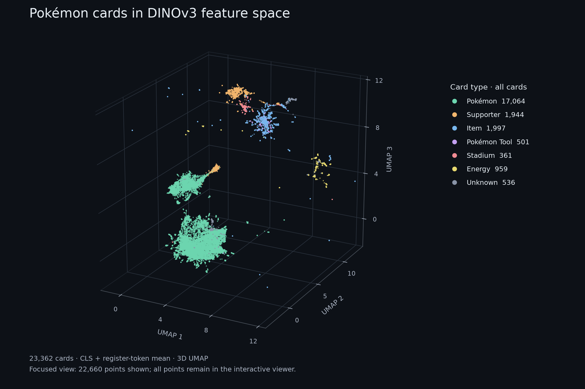

# CardScope — Pokémon Card Recognition with DINOv3

An ongoing research project exploring how visual embeddings identify Japanese Pokémon cards from photographs. DINOv3 provides the image representation; OpenCV, OCR, and catalogue metadata help distinguish the exact set, printing, and variant. A mobile web interface connects recognition experiments with price comparison.

## Inside the embedding space

**[Download the interactive view](https://github.com/GrumpyPanda98/CardScope-Pokemon-Recognition/raw/refs/heads/main/docs/embedding-space.html)** and open it in a browser. Rotate the projection, highlight a card or set, filter by card type, or switch between type, set, and source colours. Use **Full extent** to see outliers beyond the initial close view. Plotly and catalogue images require an internet connection.

The saved experiment contains **23,362 cards** represented by **DINOv3 ViT-B/16**, using the mean of the CLS token and four register tokens. The full-card vectors are projected into three dimensions with UMAP and cosine distance. The original coordinates are retained.

Colours distinguish Pokémon, Supporters, Items, Pokémon Tools, Stadiums, and Energy cards using labels from the official catalogue. The 536 cards without verified labels remain **Unknown**. The static figure shows 22,660 points in a closer view; all 23,362 are available interactively. [Figure provenance](docs/figures/embedding-provenance.json).

The projection is useful for inspecting how card layouts organise the representation. Separation in UMAP is not a measurement of recognition accuracy.

## Recognition experiments

- **Representation:** pretrained DINOv3 embeddings, L2 normalisation, and CLS/register-token pooling.
- **Retrieval:** cosine similarity against reference cards, with full-card and cropped reference views.
- **Identification:** OpenCV image evidence, OCR of names and collector numbers, and metadata-based reranking.
- **Application:** matching identified prints to market-price sources and inspecting results through a Next.js interface.

`tools/card_matcher/` contains the Python experiments, including the DINOv3 implementation and the [viewer renderer](tools/card_matcher/render_embedding_space.py). `src/` contains the interface, provider adapters, and price calculations. The [architecture report](docs/pokearbitrage_architecture_report.pdf) records the broader project design.

## Local exploration

Use Node.js 22 LTS, run `npm ci`, then `npm run dev`. The app opens directly, with no passcode. DINOv3 setup and commands are in the [matcher README](tools/card_matcher/README.md); optional services are configured through `.env.example`.

This remains a research prototype with incomplete card and price coverage. Model weights, reference-image caches, personal photos, and credentials are not included. Account-backed services are intended for local use.

Software checks: `npm test`, `npm run lint`, and `npm run build`. These check code behaviour, not real-photo recognition accuracy.
